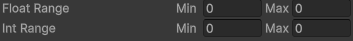

# `Range` and `RangeInt` structs

Represents a range between a minimum and a maximum.

> Not to be confused with [`UnityEngine.RangeInt`](https://docs.unity3d.com/Documentation/ScriptReference/RangeInt.html)

## Usage example

```cs
using UnityEngine;
using SideXP.Core;
using RangeInt = SideXP.Core.RangeInt;

public class RangeDemoComponent : MonoBehaviour
{
    public Range FloatRange;
    public RangeInt IntRange;

    private void Start()
    {
        Debug.Log("Random float: " + FloatRange.Random);
        Debug.Log("Random int: " + IntRange.Random);
    }
}
```

