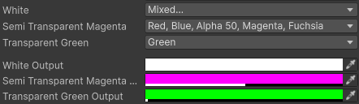

# `FColor` enumeration

Defines a color using flags.

This enum is completed by [`FColorExtensions`](../../extensions/f-color.md) class, meant to retrieve the actual [Color](https://docs.unity3d.com/Documentation/ScriptReference/Color.html) instance from the defined flags.

## Usage example

```cs
using UnityEngine;
using SideXP.Core;

public class FColorDemoComponent : MonoBehaviour
{
    public FColor White = FColor.White | FColor.Alpha100;
    public FColor SemiTransparentMagenta = FColor.Magenta | FColor.Alpha50;
    public FColor TransparentGreen = FColor.Green;
    
    [Space]

    public Color WhiteOutput;
    public Color SemiTransparentMagentaOutput;
    public Color TransparentGreenOutput;

    private void OnValidate()
    {
        WhiteOutput                     = White.ToColor();
        SemiTransparentMagentaOutput    = SemiTransparentMagenta.ToColor();
        TransparentGreenOutput          = TransparentGreen.ToColor();
    }
}
```

