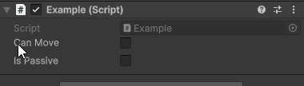
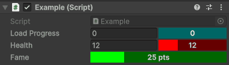
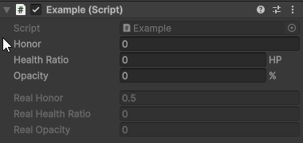
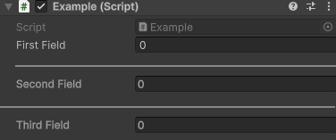
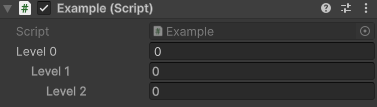
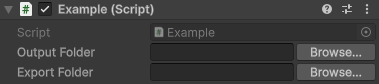
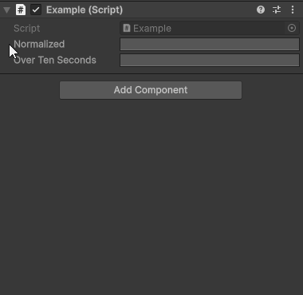
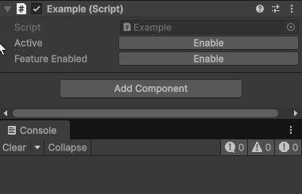

# Inspector attributes

This core package includes custom attributes that change how a serialized field is drawn in the inspector, without writing a custom editor just for it.

Usage example:

```cs
using UnityEngine;
using SideXP.Core;

public class CustomAttributesExample : MonoBehaviour
{
    [Readonly] public string id;
    [EnableIf(nameof(useCooldown))] public float cooldown;
    [ProgressBar(0, 100)] public float health;
}
```

## `Readonly`

Displays a field that is visible but not editable. Useful for debug values, generated ids, or data driven by other systems.

```cs
[Readonly] public string generatedId;
```


## `EnableIf` and `DisableIf`

Enables (or disables) a field depending on the value of another boolean field or property on the same object. Set `HideIfDisabled = true` to hide the field entirely instead of greying it out.

```cs
public bool canMove;
[EnableIf(nameof(canMove), HideIfDisabled = true)] public float speed;
[DisableIf(nameof(canMove))] public bool isPassive;
```



## `ProgressBar`

Draws a numeric field as a progress bar between a minimum and a maximum. Supports a color, a `Prefix`/`Suffix`, and `Clamp`/`Readonly`/`Wide` options.

```cs
[ProgressBar(0, 1)] public float loadProgress;
[ProgressBar(0, 42, FColor.Red, Clamp = true)] public int health;
[ProgressBar(0, 100, FColor.Green, Suffix = " MP", Wide = true)] public float fame;
```



## `Remap` and `Percents`

`Remap` lets you edit a value in one range while storing it in another. For example, edit `0–100` in the inspector but keep `0–1` in the data.

`Percents` is a ready-made specialization that displays a normalized `0–1` value as a `0–100 %` field.

```cs
[Remap(-100, 100, 0, 1)] public float honor;
[Remap(FromMax = 1f, ToMax = 42f, Units = "HP", Clamped = true)] public float healthRatio;
[Percents(Clamped = true)] public float opacity;
```



## `Separator`

Draws a separator line before the field to visually group inspector sections. Enable `Wide` to span the full inspector width.

```cs
public int firstField;
[Separator]
public int secondField;
[Separator(Wide = true)]
public int thirdField;
```



## `Indent`

Indents the field by a number of levels, to visually nest it under a preceding field.

```cs
public int level0;
[Indent] public int level1;
[Indent(2)] public int level2;
```



## `FolderPath`

Turns a `string` field into a folder path picker with a "browse" button. By default it targets folders inside the project. Set `AllowExternal = true` to allow folders anywhere on disk.

```cs
[FolderPath] public string outputFolder;
[FolderPath("Select an export folder", allowExternal: true)] public string exportFolder;
```



## `AnimCurve`

Frames an `AnimationCurve` field inside a fixed bounding box (min/max time and value) and tints the curve, so multiple curves stay visually consistent and comparable.

```cs
[AnimCurve(1, 1)] public AnimationCurve normalized;
[AnimCurve(0, 10, 0, 1, FColor.Cyan)] public AnimationCurve overTenSeconds;
```



## `Boolton`

Displays a boolean as an enable/disable button instead of the default checkbox, and can invoke a callback (a method taking a single `bool`, or a boolean property setter) when toggled.

```cs
[Boolton] public bool active;
[Boolton(nameof(OnToggled))] public bool featureEnabled;

private void OnToggled(bool value) { Debug.Log("Toggled to " + value); }
```


