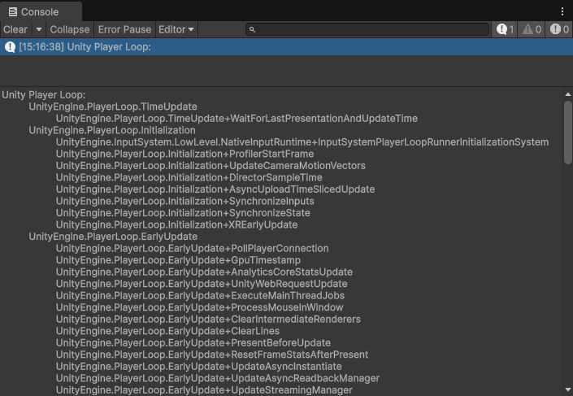

# Player Loop customization

[PlayerLoop](https://docs.unity3d.com/ScriptReference/LowLevel.PlayerLoop.html) is an API provided by Unity to access and customize the systems that can be initialized and updated at runtime.

You can see the updates and subsystems that are running at runtime from `Tools > Sideways Experiments > Viewers > Player Loops Viewer`.

## Adding a custom subsystem

```cs
using UnityEngine;
using UnityEngine.LowLevel;
using UnityEngine.PlayerLoop;
using SideXP.Core;

public class DemoCustomPlayerLoop
{
    public struct CustomUpdate { }
    
    [RuntimeInitializeOnLoadMethod(RuntimeInitializeLoadType.AfterAssembliesLoaded)]
    private static void SetupCustomUpdate()
    {
        PlayerLoopSystem customUpdateSystem = new PlayerLoopSystem
        {
            type = typeof(CustomUpdate),
            updateDelegate = () =>
            {
                if (Application.isPlaying)
                    Game.UpdateAll(Time.deltaTime);
            }
        };
        
        PlayerLoopUtility.InsertSubsystem<Update>(in customUpdateSystem);
    }
}
```

## Removing a built-in subsystem

```cs
using UnityEngine;
using SideXP.Core;

public class DemoCustomPlayerLoop
{
    [RuntimeInitializeOnLoadMethod(RuntimeInitializeLoadType.AfterAssembliesLoaded)]
    private static void RemoveDirectorUpdate()
    {
        PlayerLoopUtility.RemoveSubsystem<UnityEngine.PlayerLoop.Update.DirectorUpdate>();
    }
}
```

## Inspecting the current Player Loop

```cs
using UnityEngine;
using SideXP.Core;

public class DemoCustomPlayerLoop
{
    [RuntimeInitializeOnLoadMethod(RuntimeInitializeLoadType.AfterAssembliesLoaded)]
    private static void DisplayPlayerLoop()
    {
        PlayerLoopUtility.PrintPlayerLoop();
    }
}
```


