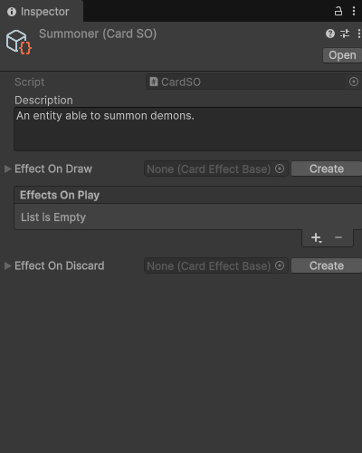

# Subassets management

## Usage example

An asset that represents a playable card in a game, with effects attached as subassets:

```cs
using UnityEngine;
using SideXP.Core;
[CreateAssetMenu(fileName = "NewCard", menuName = "Create Card Asset")]
public class CardSO : ScriptableObject
{
    [TextArea(3, 6)]
    public string description;

    // To store a single subasset, you must use the [Subasset] attribute
    [Space]
    [Subasset]
    public CardEffectBase EffectOnDraw = null;

    // To store a list of subassets, just use the SubassetsList<T> type
    [Space]
    public SubassetsList<CardEffectBase> EffectsOnPlay = new SubassetsList<CardEffectBase>();

    [Space]
    [Subasset]
    public CardEffectBase EffectOnDiscard = null;
}
```

Base effect class:

```cs
using UnityEngine;
public abstract class CardEffectBase : ScriptableObject
{
    public abstract bool Apply();
}
```

Demo *increase points* effect:

```cs
using UnityEngine;
using SideXP.Core;
[SubassetLabel("Increase points by [amount]")]
public class CardEffect_IncreasePoints : CardEffectBase
{
    public int amount;

    public override bool Apply()
    {
        Debug.Log($"Add {amount} points to player");
        return true;
    }
}
```

Demo *add card to deck* effect:

```cs
using UnityEngine;
using SideXP.Core;
[SubassetLabel("Add [card] to deck")]
public class CardEffect_AddCardToDeck : CardEffectBase
{
    public CardSO card;

    public override bool Apply()
    {
        Debug.Log($"Add card {card.name} to deck");
        return true;
    }
}
```

Demo *add effect to cards* effect:

```cs
using UnityEngine;
using SideXP.Core;
[SubassetLabel("Add [effect] to all [card] instances")]
public class CardEffect_AddEffectToCards : CardEffectBase
{
    [Subasset]
    public CardEffectBase effectToAdd;
    public CardSO card;

    public override bool Apply()
    {
        Debug.Log($"Add the effect {effectToAdd.name} to all cards instanced from {card.name}");
        return true;
    }
}
```

You will be able to create a new Card asset from `Assets > Create > Create Card Asset`.



## Adding subassets to a list

The types you can create from the `+` button of a `SubassetsList<T>` are `T` itself and all the types that inherit from it, excluding abstract and generic ones.

The `+` button behaves differently depending on these types:

- If `T` is the only type available, the `+` button creates a subasset of type `T` right away.
- Otherwise, the `+` button opens a dropdown menu to select the type of the subasset to create. This applies when `T` is abstract (even if a single class inherits from it, like `CardEffectBase` in the example above), or when several types are available.

```cs
// T is the only type available: the + button creates a CardData subasset right away
public SubassetsList<CardData> data = new SubassetsList<CardData>();

// T is abstract: the + button always opens a dropdown menu
public SubassetsList<CardEffectBase> effects = new SubassetsList<CardEffectBase>();
```

> If no type is available, clicking the `+` button logs a warning in the console, and no subasset is created.

## List options

You can customize how a `SubassetsList<T>` field is displayed in the inspector by adding the `[SubassetsListOptions]` attribute to it:

```cs
[SubassetsListOptions(DisallowRename = true, Unique = true)]
public SubassetsList<CardEffectBase> effects = new SubassetsList<CardEffectBase>();
```

- **`DisallowRename`**: By default, each subasset in the list displays a text field to rename it. If enabled, the subasset's name is displayed as a label and can't be edited from the list.
- **`NotEditable`**: By default, each subasset can be expanded in the list to edit its properties. If enabled, each item is displayed as a disabled object field instead. You can still double-click on that field to select the subasset and edit it from the inspector.
- **`Unique`**: By default, the list can contain several subassets of the same type. If enabled, the list can contain only one subasset of each type.

> `Unique` compares exact types, so inheritors of a base types will be considered different from the base type itself.

> Use `NotEditable` if the subassets of your list have `SubassetsList<T>` properties themselves: nesting these lists makes the inspector compute wrong GUI heights, so the items are not displayed properly.