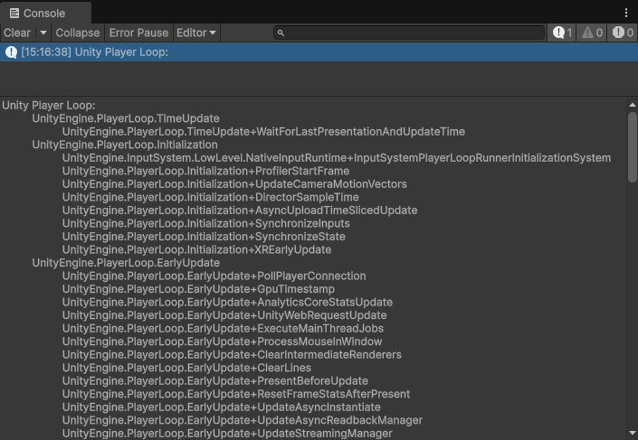

# `PlayerLoopUtility` class

[PlayerLoop](https://docs.unity3d.com/ScriptReference/LowLevel.PlayerLoop.html) is an API provided by Unity to access and customize the systems that can be initialized and updated at runtime.

You can see the updates and subsystems that are running at runtime from `Tools > Sideways Experiments > Viewers > Player Loops Viewer`.

The core library provides additional utility functions from `PlayerLoopUtility` to alter the current *Player Loop*:

## `InsertSubsystem<T>()`

Inserts a subsystem into a system of a given type.

```cs
using UnityEngine;
using UnityEngine.LowLevel;
using UnityEngine.PlayerLoop;
using SideXP.Core;

public class DemoCustomPlayerLoop
{
    public struct CustomUpdate { }
    
    [RuntimeInitializeOnLoadMethod(RuntimeInitializeLoadType.AfterAssembliesLoaded)]
    private static void SetupCustomUpdate()
    {
        PlayerLoopSystem customUpdateSystem = new PlayerLoopSystem
        {
            type = typeof(CustomUpdate),
            updateDelegate = () =>
            {
                if (Application.isPlaying)
                    Game.UpdateAll(Time.deltaTime);
            }
        };
        
        PlayerLoopUtility.InsertSubsystem<Update>(in system);
    }
}
```

## `RemoveSubsystem<T>()`

Removes a subsystem from a system of a given type.

```cs
using UnityEngine;
using SideXP.Core;

public class DemoCustomPlayerLoop
{
    [RuntimeInitializeOnLoadMethod(RuntimeInitializeLoadType.AfterAssembliesLoaded)]
    private static void RemoveDirectorUpdate()
    {
        PlayerLoopUtility.RemoveSubsystem<UnityEngine.PlayerLoop.Update.DirectorUpdate>();
    }
}
```

## `PrintPlayerLoop()`

Logs a message in console that displays the full subsystems hierarchy of the current Player Loop.

```cs
using UnityEngine;
using SideXP.Core;

public class DemoCustomPlayerLoop
{
    [RuntimeInitializeOnLoadMethod(RuntimeInitializeLoadType.AfterAssembliesLoaded)]
    private static void DisplayPlayerLoop()
    {
        PlayerLoopUtility.PrintPlayerLoop();
    }
}
```

