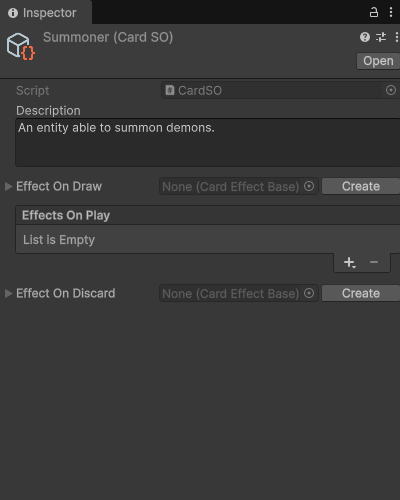

# Subassets management

@todo

## Usage example

An asset that represents a playable card in a game, with effects attached as subassets:

```cs
using UnityEngine;
using SideXP.Core;
[CreateAssetMenu(fileName = "NewCard", menuName = "Create Card Asset")]
public class CardSO : ScriptableObject
{
    [TextArea(3, 6)]
    public string description;

    // To store a single subasset, you must use the [Subasset] attribute
    [Space]
    [Subasset]
    public CardEffectBase EffectOnDraw = null;

    // To store a list of subassets, just use the SubassetsList<T> type
    [Space]
    public SubassetsList<CardEffectBase> EffectsOnPlay = new SubassetsList<CardEffectBase>();

    [Space]
    [Subasset]
    public CardEffectBase EffectOnDiscard = null;
}
```

Base effect class:

```cs
using UnityEngine;
public abstract class CardEffectBase : ScriptableObject
{
    public abstract bool Apply();
}
```

Demo *increase points* effect:

```cs
using UnityEngine;
using SideXP.Core;
[SubassetLabel("Increase points by [amount]")]
public class CardEffect_IncreasePoints : CardEffectBase
{
    public int amount;

    public override bool Apply()
    {
        Debug.Log($"Add {amount} points to player");
        return true;
    }
}
```

Demo *add card to deck* effect:

```cs
using UnityEngine;
using SideXP.Core;
[SubassetLabel("Add [card] to deck")]
public class CardEffect_AddCardToDeck : CardEffectBase
{
    public CardSO card;

    public override bool Apply()
    {
        Debug.Log($"Add card {card.name} to deck");
        return true;
    }
}
```

Demo *add effect to cards* effect:

```cs
using UnityEngine;
using SideXP.Core;
[SubassetLabel("Add [effect] to all [card] instances")]
public class CardEffect_AddEffectToCards : CardEffectBase
{
    [Subasset]
    public CardEffectBase effectToAdd;
    public CardSO card;

    public override bool Apply()
    {
        Debug.Log($"Add the effect {effectToAdd.name} to all cards instanced from {card.name}");
        return true;
    }
}
```

You will be able to create a new Card asset from `Assets > Create > Create Card Asset`.

